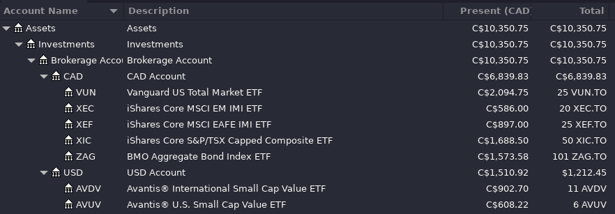

# GnuCash Asset Allocation

*GnuCash Asset Allocation* uses the information in a GnuCash book and finds how
many shares of each asset to buy to get the desired asset allocation.

Features:
  * Find optimal way to rebalance portfolio in GnuCash
  * Supports nested accounts
  * Supports multiple currencies

## Example GnuCash Book

In `example/` there is a GnuCash book that you can use to experiment with. The
contents of the file look like the following:



## Config

A config file `$XDG_CONFIG_HOME/gnucash-asset-allocation/config.ini` or
`~/.config/gnucash-asset-allocation/config.ini` should be created. An example
config is shown below:

```ini
[gnucash]
file = ~/path/to/book.gnucash # '~' and environment variables are expanded
account = Assets:Investments:Brokerage Account

[allocation]
ZAG.TO = 20
XIC.TO = 24
VUN.TO = 24
AVUV = 8
XEF.TO = 12.8
AVDV = 4.8
XEC.TO = 6.4
```

## Running

Before running it is recommended to update your price data to get the most
accurate answer.

```
$ poetry run python gnucash_asset_allocation 2001.42
 Asset Name   | Share Price   | Initial Allocation   | Target Allocation   | Final Allocation   | Amount to Buy(+) or Sell(-)   |   Shares to Buy(+) or Sell(-)
--------------+---------------+----------------------+---------------------+--------------------+-------------------------------+-------------------------------
 XEF.TO       | 35.88 (CAD)   | 10.81%               | 12.80%              | 12.19%             | 358.80 (CAD)                  |                            10
 XIC.TO       | 33.77 (CAD)   | 20.34%               | 24.00%              | 22.95%             | 675.40 (CAD)                  |                            20
 AVUV         | 82.23 (USD)   | 5.94%                | 8.00%               | 6.71%              | 164.46 (USD)                  |                             2
 ZAG.TO       | 15.58 (CAD)   | 18.96%               | 20.00%              | 19.21%             | 405.08 (CAD)                  |                            26
 VUN.TO       | 83.79 (CAD)   | 25.24%               | 24.00%              | 22.78%             | 251.37 (CAD)                  |                             3
 XEC.TO       | 29.30 (CAD)   | 7.06%                | 6.40%               | 6.26%              | 58.60 (CAD)                   |                             2
 AVDV         | 65.37 (USD)   | 8.66%                | 4.80%               | 6.98%              | 0.00 (USD)                    |                             0

Cash left over: 54.16 CAD

$ poetry run python gnucash_asset_allocation -1023
 Asset Name   | Share Price   | Initial Allocation   | Target Allocation   | Final Allocation   | Amount to Buy(+) or Sell(-)   |   Shares to Buy(+) or Sell(-)
--------------+---------------+----------------------+---------------------+--------------------+-------------------------------+-------------------------------
 AVDV         | 65.37 (USD)   | 8.66%                | 4.80%               | 1.23%              | -522.96 (USD)                 |                            -8
 XEC.TO       | 29.30 (CAD)   | 7.06%                | 6.40%               | 6.44%              | -117.20 (CAD)                 |                            -4
 VUN.TO       | 83.79 (CAD)   | 25.24%               | 24.00%              | 24.18%             | -335.16 (CAD)                 |                            -4
 ZAG.TO       | 15.58 (CAD)   | 18.96%               | 20.00%              | 20.34%             | -93.48 (CAD)                  |                            -6
 AVUV         | 82.23 (USD)   | 5.94%                | 8.00%               | 6.78%              | 0.00 (USD)                    |                             0
 XIC.TO       | 33.77 (CAD)   | 20.34%               | 24.00%              | 23.20%             | 0.00 (CAD)                    |                             0
 XEF.TO       | 35.88 (CAD)   | 10.81%               | 12.80%              | 12.33%             | 0.00 (CAD)                    |                             0


Cash Received: 1175.48 CAD
```

## Additional Resources

* [Optimal lazy portfolio rebalancing
  calculator](http://optimalrebalancing.tk): An online rebalancing calculator
* [The Lazy Portfolio Allocation
  Algorithm](https://brownan.github.io/lazy-allocation/Lazy%20Portfolio%20Allocation%20Algorithm.html):
  If you want to learn how the rebalancing algorithm works
